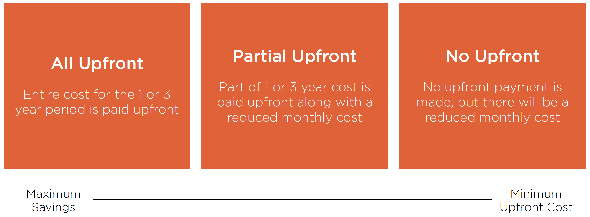

# Amazon Elastic Compute Cloud (EC2)
> Is a web service that provides resizable compute capacity in the cloud. It is designed to make web-scale computing easier for developers. 

## Instance Types
- Defines the processor, memory, and storage type
- Cannot be changed without downtime
- Provided in the following categories
    - General purpose 
    - Compute, memory, and storage optimized
    - Accelerate computing 
- Pricing is based on instance type
- Some instance types have unique capabilities
## Root Device Type
### Instance Store
Ephemeral storage that is physically attached to the host the virtual server is running on. 
### Elastic Block Store (EBS)
Persistent storage that exists separately from the host the virtual server is running on.
## Amazon Machine Image
- Template for an EC2 instance including configuration, operating system and data
- AWS provides many AMIs that can be leveraged
- AMIs can be shared across AWS accounts
- Custom AMIs can be created based on your configuration
- Commercial AMIs are available in the AWS Marketplace

## Amazon EC2 Purchase Options
### Reserved Instances
Provides discounts over the on-demand model when you can **commit to a specific period of time**. In addition, it provides a capacity reservation for the specific instance type that you specify.
#### Standard
Highest discount, works for steady workloads.

#### Convertible
Enables the conversion of **attributes**, works for **steady workloads**.

**attributes: An attribute is a name-value pair that's associated with an Amazon ECS object. Attributes enable you to extend the Amazon ECS data model by adding custom metadata to your resources.**
#### Scheduled
Works for a time window you reserve, good for a **predictable workload**.
### Savings Plan
- Similar in concept to reserved instances
- Supports compute with EC2, Fargate, and Lambda
- Unlike Reserved Instances, it does not reserve capacity
- Provide savings of up 72%
- Comes in 1 or 3 years team

### Spot Instances
Enables you to leverage excess EC2 compute capacity
- Can provide up to 90% discount over on-demand pricing
- There is a market price for instance types per availability zone called the Spot price 
- When you request instances, if your bid is higher than Spot price they will launch
- If the Spot price grows to exceed your bid, the instances will be terminated 
- Spot instances can be notified 2 minutes prior to termination

**IMPORTANT NOTE:** Please extend this topic as this is not very clear. 
### Dedicated Host
The dedicated host pricing model gives you a dedicated physical server. It will be the most expensive option, but it may be required for either server software licensing or due to a compliance requirement.
### On-Demand
Pay, by the second, for the instances that you lauch.
### Amazon EC2 Purchase Options
1. If you have an instance that **is consistent and always needed**, you should purchase a *Standard* or *Convertible Reserved Instance*
2. If you have **batch processing where the process can start and stop without affecting the job**, you should leverage *Spot Instances*
3. If you have an **inconsistent need for instances that cannot be stopped without affecting the job**, leverage *On-Demand instances*
4. If you have **specific per-server** licensing or if **you have a compliance requirement for a dedicated server**, you should use *Dedicated Host*.
5. If you are **leveraging Lambda and/or Fargate alongside EC2** and want to achieve discounts for 1 or 3 years, choose a *Savings Plan*.
6. If you have a **predictable but not steady workload in EC2**, you should purchase a *Scheduled Reserved Instance*.

***

# Elastic Beanstalk
> Is an easy-to-use service for deploying and scaling web applications and services developed with Java, .NET, PHP, Node.js, Python, Ruby, Go, and Docker on familiar servers such as Apache, Nginx, Passenger, IIS.

- Automates the process of deploying and scaling workloads on EC2 (PaaS)
- Supports a specific set of technologies
- Leverages existing AWS services
- Only pay for the other services you leverage
- Handles provisioning, load balancing, scaling, and monitoring. 

## Features
- Monitoring 
- Deployment 
- Scaling 
- EC2 Customization 
## Use Cases
- Deploy an application with minimal knowledge of other services
- Reduce the overall maintenance needed for the application
- Few customizations are required

# AWS Lambda
> Lets you run code without provisioning or managing servers. You pay only for the compute time you consume. You can run code for virtually any type of application or backend service -all with zero administration.

- Enables the running of code without provisioning infrastructure
- Only charged for usage based on execution time
- Can figure available memory from 128 MB to 3008 MB 
- Integrates with many AWS services
- Enables event-driven workflows
- Primary service for serverless architecture
## Advantages
- Reduced maintenance requirements
- Enables fault tolerance without additional work
- Scales based on demand
- Pricing is based on usage

